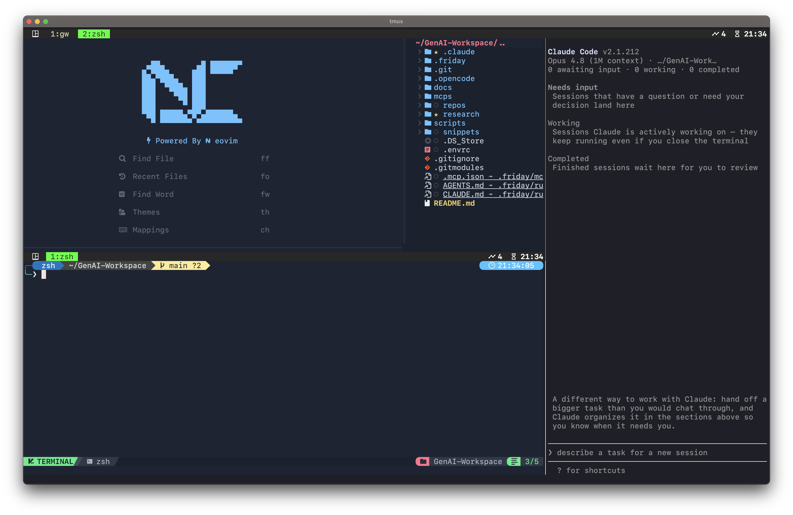

# GenAI Workspace

Terminal-first setup for driving hosted and local AI models across Claude Code, Cursor, Codex CLI, and OpenCode. One shared source of truth, symlinked into whatever each tool expects.



One command (`gw`) drops you into a tmux workspace — Neovim on the left, Claude Code on the right — so editing and AI sessions share one screen. Hand off a task and Claude sorts it into *Needs input · Working · Completed* while you keep coding.

Background research and tooling comparison that led to this setup: [docs/tooling-research.md](docs/tooling-research.md).

Project conventions (git, snippets, coding style) live in [.friday/rules.md](.friday/rules.md), the source of truth symlinked as `CLAUDE.md` / `AGENTS.md` / `.cursorrules`.

## `.friday/`: shared source of truth

`.friday/` holds everything shared across harnesses (rules, MCP config, skills, commands) in one place instead of scattered across `.claude/`, `.opencode/`, `.cursor/`, etc. Each harness reads from its own path, so `.friday/init` symlinks the canonical files into place.

### Why "friday"?

The name is borrowed from Friday, a separate private project: a self-hosted personal AI system — a homelab stack of GenAI tools, content pipelines, and experiments, all running on your own hardware with no cloud dependency by default. It's a nod to Tony Stark's AI assistant F.R.I.D.A.Y. (Female Replacement Intelligent Digital Assistant Youth), the successor to J.A.R.V.I.S. — an always-available, locally-running intelligence that handles the repetitive and creative work so you can focus on what matters.

This repo's `.friday/` directory carries the same name because it's the same idea applied to editor tooling: one shared, always-available source of truth instead of config scattered and duplicated across every harness.

```
.
├── .friday/
│   ├── init          # bootstrap script — creates the symlinks below
│   ├── cleanup       # removes symlinks .friday/init created
│   ├── rules.md      # source of truth for instructions, symlinked as CLAUDE.md / AGENTS.md / .cursorrules
│   ├── mcp.json      # MCP server definitions, symlinked as .mcp.json
│   ├── skills/       # curated skills surface, symlinked into .claude/skills
│   ├── commands/     # Claude Code-formatted slash commands, symlinked into .claude/commands
│   └── vendor/       # raw upstream git submodules that skills/ symlinks into
└── repos/            # gitignored — clone the repos you work on in here (see below)
```

### Setup

```bash
bash .friday/init
```

Prompts for which tooling you use (Claude Code, Cursor, Codex CLI/OpenCode) and symlinks accordingly:

| Tool | Link created |
|---|---|
| Claude Code | `CLAUDE.md`, `.mcp.json`, `.claude/skills`, `.claude/commands` |
| Cursor | `.cursorrules` |
| Codex CLI / OpenCode | `AGENTS.md` |

Idempotent: re-run any time to fix drifted links. If a real file already exists at a link path, it's backed up to `<file>.bak` before being replaced. The generated links are per-user setup, not project source, so they're gitignored.

```bash
bash .friday/cleanup   # remove the symlinks .friday/init created
```

### Adding a skill

Skills are Markdown (`SKILL.md`) directories. Two ways to add one:

- **Own skill:** create it directly under `.friday/skills/<name>/SKILL.md`.
- **Vendored skill** (lives inside a third-party monorepo, so a plain submodule would pull in unrelated code):

  ```bash
  git submodule add <ssh-url> .friday/vendor/<upstream-repo>
  ln -s ../vendor/<upstream-repo>/skills/<skill-name> .friday/skills/<skill-name>
  ```

  `vendor/` stays an unmodified upstream clone. `skills/` is the curated, symlinked surface that `.friday/init` wires into each harness.

### Adding a command

Commands are Claude Code formatted Markdown under `.friday/commands/`, e.g. `.friday/commands/friday-snippet.md`:

```markdown
---
description: One-line description shown in the command list
argument-hint: [optional hint for $ARGUMENTS]
---

Command body. Instructions Claude Code follows when you run /friday-snippet.
```

One example already in the repo: `/friday-snippet` turns a topic into a one-pager under `snippets/` (gitignored, never pushed).

`.friday/init` symlinks `.friday/commands` → `.claude/commands`, so any file added here becomes a `/name` slash command in Claude Code automatically. No cross-tool equivalent exists yet: Cursor and other harnesses use different formats, so commands only work in Claude Code today.

### Editing rules

`.friday/rules.md` is the single source of truth for cross-harness instructions, symlinked as `CLAUDE.md`, `AGENTS.md`, and `.cursorrules`. Edit it once and every harness picks up the change.

### `repos/`: where your projects live

`repos/` is a gitignored scratch space for cloning the actual repos you work on day to day (e.g. `repos/my-app`). It's not part of this project's source — it's just a convenient, out-of-the-way place to keep them alongside the shared `.friday/` config.

Bootstrap a repo under `repos/` against this hub's shared setup instead of creating its own `.friday/`:

```bash
bash .friday/init repos/<name>
```

This wires that repo's `CLAUDE.md`, `.mcp.json`, `.claude/skills`, etc. to point back at this hub's `.friday/`, so every project you clone into `repos/` shares the same rules, skills, and commands.

### Making `.friday/` global across projects

Harnesses resolve `.friday` relative to the working directory, so a project can't just point at `~/.friday`. Keep a canonical `.friday` at `$HOME` instead, and symlink it *into* each project that wants the shared setup:

```bash
# in a project root
ln -s ~/.friday .friday
```

Projects that need their own overrides keep a real, project-local `.friday/` instead of the symlink.
