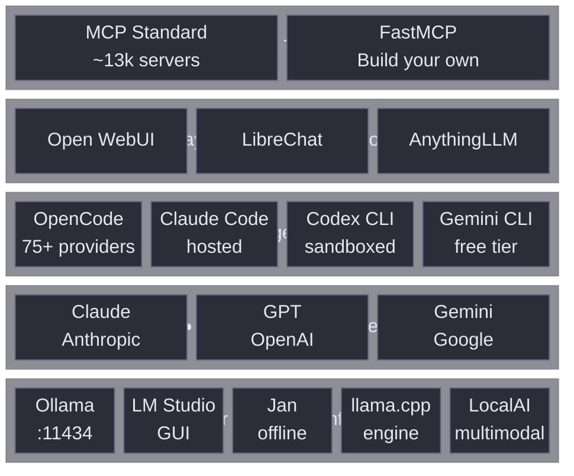

*Terminal-first setup driving hosted and local models for varied tasks. Researched mid-2026. Star counts and rankings are snapshots.*

## 1. Goal

- Talk to **hosted** models ([Claude](https://claude.ai), [GPT](https://platform.openai.com), [Gemini](https://gemini.google.com)) *and* **local** models ([Ollama](https://ollama.com)/[llama.cpp](https://github.com/ggerganov/llama.cpp)) through one interface
- Cover varied tasks — chat, research, refactors, agentic automation, RAG
- Stay **terminal-first** and **version-controlled**

## 2. Mental model: a stack, not one app



| Layer | Role | Examples |
|---|---|---|
| **1. Inference / serving** | Loads weights, runs inference, exposes API | [Ollama](https://ollama.com), [LM Studio](https://lmstudio.ai), [llama.cpp](https://github.com/ggerganov/llama.cpp), [vLLM](https://github.com/vllm-project/vllm), [LocalAI](https://localai.io), [Jan](https://jan.ai) |
| **2. Agent / harness** | Reads files, runs shell, edits repos, calls tools, loops | [OpenCode](https://opencode.ai), [Claude Code](https://claude.ai/code), [Codex CLI](https://github.com/openai/codex), [Gemini CLI](https://github.com/google-gemini/gemini-cli) |
| **3. Chat / workspace UI** | Conversational front-end, RAG, history | [Open WebUI](https://openwebui.com), [LibreChat](https://librechat.ai), [AnythingLLM](https://anythingllm.com), [Msty](https://msty.app) |
| **4. Tool / extension protocol** | Give models "hands and feet" | [MCP](https://modelcontextprotocol.io) + [FastMCP](https://github.com/jlowin/fastmcp) |

Model and harness are independent — swap hosted ↔ local without changing workflow. Spine: **Layer 1 + Layer 2 + Layer 4**. Layer 3 is optional.

## 3. Rubric

**Highest weight: 4, 6, 9. Gates (hard constraints): 7, 8, 11, 13.**

| # | Criterion |
|---|---|
| 1 | Ease of setup |
| 2 | Mac + Linux support |
| 3 | Config in VCS / git |
| **4** | **Agents, tools, MCP — easy to build your own** |
| 5 | Terminal-first |
| **6** | **Model & provider flexibility** (hosted+local, switchable per task) |
| 7 | License / lock-in (OSI vs source-available vs proprietary) |
| 8 | Privacy / offline capability |
| **9** | **Active maintenance / momentum** |
| 10 | Headless / scriptable / CI-friendly |
| 11 | Permission / safety controls (plan vs build, sandboxing) |
| 12 | Task breadth beyond code |
| **13** | **Model recency (hard gate)** — no weights older than 6 months from current date |

## 4. The landscape, by layer

### Layer 1 — Local inference / serving

All consumer runners wrap [llama.cpp](https://github.com/ggerganov/llama.cpp) / MLX. Raw speed is within a few percent on the same hardware. Choose on interface, API behaviour, and MCP/tool support.

> **Gate 13 — model recency:** use weights released within the last 6 months only. Older models have degraded tool-calling adherence — the main cause of agentic loops stalling. Compliant picks as of 2026-06-28: **gemma4**, **qwen3.5-series**, **granite4.1**. Re-audit quarterly at [ollama.com/library?sort=newest](https://ollama.com/library?sort=newest).

**Runners:**

- **[Ollama](https://ollama.com)** — Go binary, background daemon, OpenAI-compat on `:11434`, MIT. Only runner with **first-class MCP**. **Default pick.**
- **[llama.cpp](https://github.com/ggerganov/llama.cpp)** — underlying engine. Use directly for exotic quants, embedding servers, or 8–16 GB Macs where Ollama's MLX path is unavailable.
- **[LM Studio](https://lmstudio.ai)** — polished GUI, HuggingFace browser, OpenAI-compat on `:1234`. Closed-source; no MCP; server dies when app closes.
- **[Jan](https://jan.ai)** — open-source, fully offline, API on `:1337`. Gaps in OpenAI-style **function calling** — test before committing.
- **[vLLM](https://github.com/vllm-project/vllm)** — high-throughput production serving. Linux/remote GPU only.
- **[LocalAI](https://localai.io)** — full OpenAI drop-in, multimodal, mature function calling.

#### Ollama vs llama.cpp direct (macOS)

Ollama ≥ 0.19 (March 2026) uses **Apple's MLX framework** on Apple Silicon — faster than llama.cpp on 32 GB+ Macs. Falls back to GGML/Metal on 8/16 GB.

| | Ollama ≥ 0.19 (MLX) | llama.cpp (GGML/Metal) |
|---|---|---|
| **macOS backend** | MLX (Apple-native) | GGML + Metal |
| **Model format** | MLX safetensors (`:mlx` tags) or GGUF | GGUF (quantized) |
| **Setup** | `brew install ollama` | Build from source |
| **Decode speed (8B, M2 Pro)** | 80–112 tok/s | 40–55 tok/s |
| **RAM requirement** | 32 GB+ for MLX; falls back on less | 8 GB+ |
| **Model management** | `ollama pull` | Manual |
| **Custom quant** | Limited | Full (Q2_K through F16) |
| **MCP / API** | First-class MCP, `:11434` | `:8080` via `llama-server` |
| **Best for** | Fast zero-config local API | Custom quants, embedding servers, 8/16 GB Macs |

**Quantization sweet spot:** Q4_K_M — ~5 GB for 8B, good daily-use quality.

```
32 GB+ Mac, zero-config?                         → Ollama (MLX, pull :mlx tags)
8 GB or 16 GB Mac?                               → llama.cpp (GGML/Metal)
Need embeddings or custom quants?                → llama.cpp
```

### Layer 2 — Terminal-first agents / harnesses ★

- **[OpenCode](https://opencode.ai)** *(MIT, ~176k stars)* — 75+ providers incl. Ollama, plain-text `opencode.json`, Plan/Build modes, MCP, custom commands as Markdown. **Strongest all-round fit.**
- **[Claude Code](https://claude.ai/code)** *(Anthropic, premium)* — elite reasoning, large context, #2 Terminal-Bench 2.1. Anthropic-only. Strong MCP + subagent story.
- **[Codex CLI](https://github.com/openai/codex)** *(OpenAI, OSS)* — **OS-level sandbox by default**, #1 Terminal-Bench 2.1. OpenAI-only. See §4.1.
- **[Gemini CLI](https://github.com/google-gemini/gemini-cli)** *(Google, OSS)* — **generous free tier**, 1M-token context, Plan Mode. Gemini-centric.

#### §4.1 — Codex CLI sandbox execution

Every shell command runs inside an OS-level sandbox by default — no network, read-only filesystem outside the working directory.

```yaml
# ~/.codex/config.yaml
model: gpt-4.1
approvalPolicy: auto          # auto | on-failure | never
sandbox: true
sandboxNetworkPolicy: none    # none | localhost | unrestricted
```

| `approvalPolicy` | Behaviour |
|---|---|
| `auto` | Runs without asking; sandbox still active |
| `on-failure` | Asks only on non-zero exit |
| `never` | Asks before every command |

Commands needing network (`npm install`, `curl`) require `sandboxNetworkPolicy: unrestricted`. Prefer that over disabling the sandbox entirely — filesystem isolation is preserved.

Project instructions use `AGENTS.md` — same file as OpenCode, one shared source.

### Layer 3 — Chat / workspace UI (optional)

- **[Open WebUI](https://openwebui.com)** — private ChatGPT stack, team accounts/SSO
- **[LibreChat](https://librechat.ai)** — multi-model, plugins, Azure/OpenAI/local
- **[AnythingLLM](https://anythingllm.com)** — built-in RAG
- **[Msty](https://msty.app)** — engine manager + chat

### Layer 4 — Tool protocols: MCP and alternatives

[MCP](https://modelcontextprotocol.io) decouples tool capability from agent identity — one server works across OpenCode, Claude Code, Codex CLI, etc. Ecosystem: ~13k servers.

#### Alternatives to MCP

| Approach | When to use | Trade-off |
|---|---|---|
| **[MCP](https://modelcontextprotocol.io)** | Tool shared across harnesses | Extra server process |
| **Native tool use (API-level)** | Single harness, tools defined in code | Not portable |
| **OpenAI built-in tools** (`code_interpreter`, `file_search`) | Sandboxed exec or doc search | Cloud-only |
| **Bash/shell tools** | Quick one-off scripts | Harness-specific |
| **[Composio](https://composio.dev)** | Managed integrations (GitHub, Jira, Slack) | Third-party cloud |

Multi-harness or shared with teammates → MCP. Personal script, one harness → shell tool.

#### Building your own MCP server

[FastMCP](https://github.com/jlowin/fastmcp) (Python) powers ~70% of MCP servers. Type hints + docstring auto-generate the schema.

```python
from fastmcp import FastMCP
mcp = FastMCP("my-tools")

@mcp.tool
def add(a: int, b: int) -> int:
    """Add two numbers."""
    return a + b

if __name__ == "__main__":
    mcp.run()
```

Use **stdio** for local dev, **[Streamable HTTP](https://modelcontextprotocol.io/docs/concepts/transports)** for remote. SSE transport deprecated 2026.

**Power pattern:** hosted model for main loop + local Ollama model via MCP for cheap, private subtasks (e.g. git diff summarisation — zero cloud tokens).

## 5. Scored comparison — harness layer

●●● strong / ●● ok / ● weak

| Tool | 1 Setup | 3 Git-config | 4 MCP+build | 5 Terminal | 6 Hosted+local | 7 License | 9 Momentum | 12 Breadth |
|---|---|---|---|---|---|---|---|---|
| **[OpenCode](https://opencode.ai)** | ●●● | ●●● | ●●● | ●●● | ●●● (75+) | ●●● MIT | ●●● daily | ●● code-lean |
| **[Claude Code](https://claude.ai/code)** | ●●● | ●●● | ●●● | ●●● | ● Anthropic-only | ● proprietary | ●●● | ●● code-lean |
| **[Codex CLI](https://github.com/openai/codex)** | ●●● | ●● | ●● | ●●● sandbox | ● OpenAI-only | ●●● OSS | ●●● | ●● code |
| **[Gemini CLI](https://github.com/google-gemini/gemini-cli)** | ●●● | ●● | ●● | ●●● | ●● Gemini-centric | ●●● OSS | ●●● | ●● code |

Hosted+local + open licence + momentum → **OpenCode**. Strictest sandbox → **Codex CLI**.

## 6. Current setup vs proposed stack

### Current setup

| Layer | What's running | Notes |
|---|---|---|
| Inference | [Ollama](https://ollama.com) (occasional) | Simple/fast tasks only |
| Harness | [Claude Code](https://claude.ai/code) | Primary — subscription, no API key |
| Models | Claude hosted (Sonnet/Opus) | Ollama fallback for low-stakes tasks |
| Config | `~/.claude/settings.json` | Git-trackable |
| Tools/MCP | Ad-hoc | No systematic setup yet |

**Works well:** high-trust, high-capability loop. Large context, strong reasoning. No per-token anxiety on subscription.

**Gaps:**

| Criterion | Gap |
|---|---|
| **6 — Model flexibility** | Locked to Anthropic |
| **7 — License** | Proprietary; no OSI fallback |
| **8 — Privacy/offline** | Every token leaves the machine |
| **10 — Headless/CI** | `--print` flag exists but not CI-native |
| **12 — Task breadth** | Code-first by design |

### Add OpenCode alongside Claude Code

Keep Claude Code. Add [OpenCode](https://opencode.ai) as the local/provider-agnostic layer.

**The loop-exit problem with OpenCode + Ollama is a model problem, not OpenCode's.** Common first picks (`llama3.2`, `qwen2.5-coder:7b`, older Mistral) weren't trained for agentic tool-call loops. Fix: Gate 13 — post-Jan 2026 weights only.

| | Claude Code only | + OpenCode |
|---|---|---|
| Simple/fast tasks | Hosted Claude — costs tokens | Local model — free |
| Private context | Leaves machine | Stays on machine |
| Complex reasoning | Strong | Unchanged |
| Offline | None | Full (local tasks) |
| Provider lock-in | Anthropic-only | + any Ollama model |
| Config in git | `.claude/settings.json` | + `opencode.json` |

Migration risk: low. Claude Code stays as-is.

## 7. Recommended blueprint

1. **[Ollama](https://ollama.com)** always-on daemon (`:11434`, MCP-capable). Pull smallest viable tool-calling model.
2. **Local models (Gate 13, audited 2026-06-28):** `qwen3.5:9b` (~6 GB) default; `granite4.1:3b` (~2 GB) if sluggish; `gemma4:12b` only if quality demands. No models >12B on a daily-use machine.
3. **[OpenCode](https://opencode.ai)** as primary harness. Configure hosted key (Claude/GPT/Gemini) + local Ollama endpoint; switch per task.
4. **Tools:** community [MCP servers](https://modelcontextprotocol.io/servers) for git/filesystem/web; custom tools via [FastMCP](https://github.com/jlowin/fastmcp).
5. **Config in git:** `AGENTS.md` + `opencode.json` + `~/.claude/settings.json` + command Markdown files + MCP definitions — all plain text in dotfiles.
6. **Optional:** [Open WebUI](https://openwebui.com) later for a browser surface over the same Ollama backend.

## 8. Organizing skills, commands, and rules across tools

Each harness reads from its own directory. Symlinks and shared files keep one source of truth.

### Where each tool reads

| Tool | Instructions | Commands / rules | Config |
|---|---|---|---|
| **[Claude Code](https://claude.ai/code)** | `CLAUDE.md` | `.claude/commands/*.md` | `~/.claude/settings.json` |
| **[OpenCode](https://opencode.ai)** | `AGENTS.md` | `.opencode/` | `opencode.json` |
| **[Codex CLI](https://github.com/openai/codex)** | `AGENTS.md` | — | `~/.codex/config.yaml` |
| **[Cursor](https://cursor.sh)** | `.cursorrules` or `.cursor/rules/*.mdc` | `.cursor/rules/*.mdc` | `.cursor/` |

### Recommended layout

```
project/
├── CLAUDE.md          # source of truth
├── AGENTS.md          # symlink → CLAUDE.md
├── .cursorrules       # symlink → CLAUDE.md
├── opencode.json
├── .claude/commands/
└── .cursor/rules/
    ├── general.mdc
    └── typescript.mdc
```

```bash
ln -s CLAUDE.md AGENTS.md
ln -s CLAUDE.md .cursorrules
```

### What goes where

| Content | Location | Notes |
|---|---|---|
| Coding style, architecture | `CLAUDE.md` (symlinked) | All tools pick this up |
| Cursor IDE behaviour | `.cursor/rules/*.mdc` | Cursor only |
| Claude Code workflows | `.claude/commands/*.md` | Document in `CLAUDE.md` for visibility |
| OpenCode provider/model routing | `opencode.json` | Commit to git |
| Codex CLI sandbox policy | `~/.codex/config.yaml` | User-level, not project-scoped |

### Installing skills from a registry

**Claude Code** has a CLI registry:

```bash
claude skills install visual-plan
claude skills install mermaid-architecture
claude skills list
```

Skills land in `.claude/skills/<name>/` — plain Markdown, inspectable, version-controllable.

**OpenCode** uses `.opencode/skills/`. No central registry yet; install by copying or symlinking.

**Cursor rules** are shared via [cursor.directory](https://cursor.directory) — copy `.mdc` content into `.cursor/rules/`.

### Managing your own skills and rules across projects

*Audited: 2026-07-01*

No tool in the cross-tool AI config sync space has crossed 10K GitHub stars — the category is 6–12 months old. The adjacent tools with real traction solve different problems: **repomix** packs repos into LLM-friendly files; **agentsmd/agents.md** is the AGENTS.md community spec (not a sync tool).

| Repo | Stars | What it does | Gap |
|---|---|---|---|
| [yamadashy/repomix](https://github.com/yamadashy/repomix) | ~27K | Packs repo into AI-friendly file | Context feeding, not config sync |
| [agentsmd/agents.md](https://github.com/agentsmd/agents.md) | ~23K | AGENTS.md community spec | Spec only — no tooling |
| [steipete/agent-rules](https://github.com/steipete/agent-rules) | ~5.7K | Rules drop-in for Claude Code / Cursor | Single-author personal rules |
| [block/ai-rules](https://github.com/block/ai-rules) | ~110 | CLI to generate rules for 11 agents | Early-stage |
| [dot-agents/dot-agents](https://github.com/dot-agents/dot-agents) | ~50 | `~/.agents/` unifier | Early-stage |
| [yujiosaka/knowhub](https://github.com/yujiosaka/knowhub) | ~42 | CLI sync to tool-specific paths | Early-stage |
| [betagouv/agnostic-ai](https://github.com/betagouv/agnostic-ai) | ~26 | `.ai/` dir → generated tool configs | Early-stage |
| [agent-rules/agent-rules](https://github.com/agent-rules/agent-rules) | ~20 | Community standard spec | Spec only |

The de-facto baseline is `AGENTS.md` at the project root — read natively by OpenCode, Codex CLI, Cline, and 28+ harnesses; Claude Code falls back to it when no `CLAUDE.md` is present. Re-audit quarterly; this space is moving fast.

`.friday` is a project-level directory that holds everything shared across harnesses — skills, rules, prompts, and MCP definitions — in one place rather than scattered across `.claude/`, `.opencode/`, `.cursor/`, etc.

```
project/
└── .friday/
    ├── skills/
    │   ├── deploy/SKILL.md
    │   └── review/SKILL.md
    ├── rules.md          # source of truth (symlinked as CLAUDE.md, AGENTS.md)
    └── mcp.json
```

**Making it global via `$HOME` symlink:**

Because all harnesses resolve `.friday` relative to the working directory, symlinking `~/.friday` into a project has no effect — they won't look there. The trick runs the other way: keep a canonical `.friday` at `$HOME` and symlink *into* each project:

```bash
# In a project root
ln -s ~/.friday .friday
```

Now every project that has this symlink shares the same skills, rules, and MCP definitions from `~/.friday`. Projects that need overrides get their own `.friday/` without the symlink.

```
~/.friday/               ← single source of truth
    skills/
    rules.md
    mcp.json

project-a/.friday → ~/.friday    ← global
project-b/.friday/               ← project-specific override
```

This keeps the convention project-level (every tool sees `.friday` in the repo root) while a single symlink makes the setup global with zero per-project maintenance.

### Vendoring third-party skills via `.friday/vendor/`

Some skills live inside a third-party monorepo alongside unrelated code — a git submodule can't check out just one subdirectory, so the whole repo has to be cloned. `.friday/vendor/` holds these raw upstream clones as git submodules; `.friday/skills/` symlinks in only the specific skill that's wanted, keeping the harness-facing directory clean:

```
.friday/
├── vendor/
│   └── <upstream-repo>/            # git submodule, full upstream repo
│       └── skills/<skill-name>/SKILL.md
└── skills/
    └── <skill-name> -> ../vendor/<upstream-repo>/skills/<skill-name>
```

```bash
git submodule add <ssh-url> .friday/vendor/<upstream-repo>
ln -s ../vendor/<upstream-repo>/skills/<skill-name> .friday/skills/<skill-name>
```

`vendor/` = unmodified upstream dependencies (submodules). `skills/`, and later `commands/` if the need arises, = the curated, symlinked surface that `.friday/init` wires into each harness's expected path.

### Cursor `.mdc` frontmatter

```markdown
---
description: TypeScript conventions
globs: ["**/*.ts", "**/*.tsx"]
alwaysApply: false
---
Always use `const` over `let`...
```

### Key points

- `AGENTS.md` is the cross-tool standard for OpenAI-ecosystem harnesses (Codex CLI, OpenCode).
- Claude Code commands have no cross-tool equivalent — document them in `CLAUDE.md`.
- MCP server definitions live in each tool's config separately — no shared format yet.
- Codex CLI sandbox details: `~/.codex/config.yaml` — see §4.1.

## 9. Caveats

- **Rankings churn monthly** — verify [Terminal-Bench](https://terminal-bench.com) scores before deciding.
- **[Jan](https://jan.ai) function-calling gaps** and **[LM Studio](https://lmstudio.ai) no MCP** — test tool-heavy paths first.
- **Ollama MLX requires 32 GB+** — 8/16 GB Macs fall back to GGML/Metal; use llama.cpp direct instead.
- **License nuance** — AGPL/BSL/FSL ≠ "open source"; check before commercial use.
- **MCP transport** — use [Streamable HTTP](https://modelcontextprotocol.io/docs/concepts/transports); SSE is deprecated.
- **Codex CLI + network** — commands needing outbound network require `sandboxNetworkPolicy: unrestricted`; missing this produces silent failures.

*Sources: [OpenCode](https://opencode.ai), [Ollama](https://ollama.com), [FastMCP](https://github.com/jlowin/fastmcp) docs; [Terminal-Bench 2.1](https://terminal-bench.com); [Ollama MLX blog](https://ollama.com/blog/mlx). Surveyed June 2026. Figures are point-in-time.*
